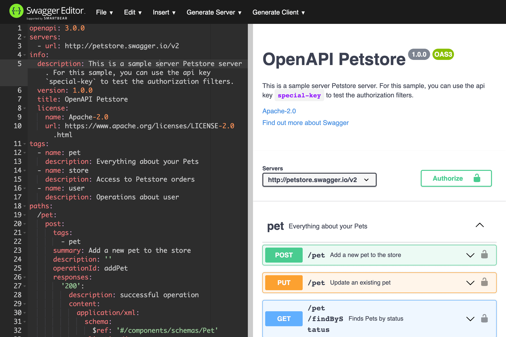

# Start [OpenAPITools][]

[OpenAPITools]: https://github.com/OpenAPITools

- [OpenAPI Specification](https://spec.openapis.org/oas/latest.html)
- [OpenAPI Generator](https://github.com/OpenAPITools/openapi-generator)
  - [OpenAPI Generator vs Swagger Codegen](https://openapi-generator.tech/docs/faq/#what-is-the-difference-between-swagger-codegen-and-openapi-generator)

## Quick start

Generate Go API client for Petstore server (in Docker):

```bash
docker run --rm -v "${PWD}:/local" openapitools/openapi-generator-cli generate \
-i https://raw.githubusercontent.com/openapitools/openapi-generator/master/modules/openapi-generator/src/test/resources/3_0/petstore.yaml \
-g go \
-o /local/out/go
```

The generated code will be located under `./out/go` in the current directory.

<!--
docker pull swaggerapi/swagger-editor
docker run -d -p 80:8080 swaggerapi/swagger-editor

docker pull swaggerapi/swagger-ui
docker run -p 80:8080 swaggerapi/swagger-ui
-->

Open [Swagger Editor](https://editor.swagger.io/) `File > Import URL` to see `petstore.yaml` API:



See `openapi-generator-cli` usage:

```bash
❯ docker run --rm -it \
-v "${PWD}:/local" \
--entrypoint /bin/bash \
openapitools/openapi-generator-cli

# ln -s /usr/local/bin/docker-entrypoint.sh /usr/local/bin/openapi-generator
# openapi-generator help
# openapi-generator help generate
```
